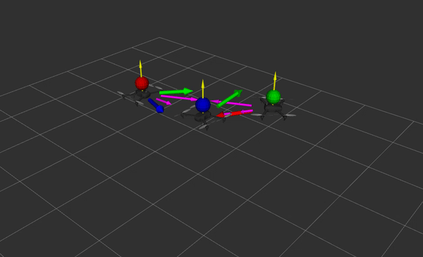

# Bearing control for formations of drones
Robotic project 2019 - École Centrale Nantes



### Assumptions

It is necessary to have the following ROS packages : [`mavros`,`mavlink`](https://dev.px4.io/en/ros/mavros_installation.html), 
[`aruco_detect`](https://github.com/UbiquityRobotics/fiducials.git), [`qualisys`](https://github.com/KumarRobotics/qualisys.git), `fake_qualisys` and [`plotjuggler`](https://github.com/facontidavide/PlotJuggler.git)

### Clone the PX4/Firmware code, then build the SITL code
```sh
cd ~
git clone https://github.com/matheus220/Firmware.git
cd Firmware
git submodule update --init --recursive
make posix_sitl_default gazebo # Ctrl+C after gazebo starts
```
Source your environment : add to file .bashrc
```sh
source ~/Firmware/Tools/setup_gazebo.bash ~/Firmware ~/Firmware/build/px4_sitl_default
export ROS_PACKAGE_PATH=$ROS_PACKAGE_PATH:~/Firmware:~/Firmware/Tools/sitl_gazebo
```

### drones package

#### Clone and build drones package

```sh
cd ~/catkin_ws/src
git clone https://github.com/matheus220/drones.git
catkin build drones
source ~/catkin_ws/devel/setup.bash
```

#### Launch simulation

```sh
roslaunch drones multi_uav_mavros_sitl.launch
```

> Some **ERROR** and **WARN** messages may appear on the console, however, this does not affect the simulation. This happens when the noises of the simulator's sensors are set to zero ([here](https://github.com/matheus220/drones/blob/2c0f5575932d1d47c93e536415be9b7906dac191/models/rotors_description/urdf/iris_base.xacro#L55) and [here](https://github.com/matheus220/drones/blob/2c0f5575932d1d47c93e536415be9b7906dac191/models/rotors_description/urdf/iris_base.xacro#L82-L117)).

#### Launch controller

There are 3 control modes of simulation of the project: **ground truth**, **ball detection** 
and **aruco marker detection** and one experimental test mode.\
\
Before launching the controller it is necessary to specify the type of marker that will be used, 
for this the lines [animation.launch](https://github.com/matheus220/drones/blob/d3a54190c8990521c5361255c4423d6cb700cb9e/launch/animation.launch#L7) and 
[multi_uav_mavros_sitl.launch](https://github.com/matheus220/drones/blob/54cebc6df363ecd72bf6a89ca2db77e68a4199bd/launch/multi_uav_mavros_sitl.launch#L8) 
must be modified to correspond to one of the lower options

```sh
<arg name="target" value=""/> # no objects to detect
<arg name="target" value="_ball"/> # ball detection object
<arg name="target" value="_aruco"/> # object detection aruco markers
```

The controller can then be launched

+ ##### ground truth
```sh
roslaunch drones simulation_ground_truth.launch
```

+ ##### ball detection
```sh
roslaunch drones simulation_ball.launch
```

+ ##### aruco marker detection
```sh
roslaunch drones simulation_aruco.launch
```

+ ##### experimental test
In this mode only 2 drones are simulated and a real drone is used, so remove one of the drones from the **multi_uav_mavros_sitl.launch** file.

> **Important**: In the simulations the IDs of the drones are 1, 2 and 3. For the experimental test, 
IDs 4, 5 and 6 are used. Then, due to this change, it is necessary to comment two lines and uncomment two others in the following code snippets :
[animation_rviz.cpp](https://github.com/matheus220/drones/blob/9b15be0b8ee5c965a9609052f58106ec4108f250/src/animation_rviz.cpp#L103-L106) and 
[command_creator.cpp](https://github.com/matheus220/drones/blob/9b15be0b8ee5c965a9609052f58106ec4108f250/src/command_creator.cpp#L207-L213)

```sh
roslaunch drones experimental_setup.launch
roslaunch drones experimental.launch
```

### Bibliography

> Fabrizio Schiano, Paolo Robuffo Giordano.
Bearing rigidity maintenance for formations of
quadrotor UAVs.
ICRA 2017 - IEEE International Conference on Robotics and Automa-
tion, May 2017, Singapore, Singapore. pp.1467 - 1474, 2017, <http://www.icra2017.org/>.
<10.1109/ICRA.2017.7989175>. <hal-01482422v2>
